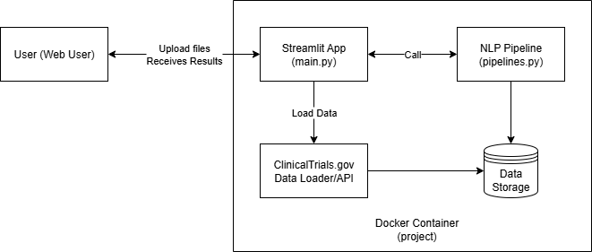

# **Architecture Overview**

**Project:** Biomedical LLM Information Extraction Tool  
**Version:** 0.1  
**Author:** Elena Jolkver  
**Date:** 25.09.2025      
This document provides a high-level overview of the architecture for the Biomedical LLM Information Extraction Tool, detailing its components, interactions, and design principles. 

## **1. High-Level Architecture Diagram**

This diagram illustrates the main components of the system, including the user interface, NLP processing pipeline, data handling, and deployment layer. Each component is designed to work together seamlessly to provide a robust information extraction tool for biomedical documents.

## **2. Component Overview**

### 2.1 User Interface (Streamlit Frontend)
- Provides a browser-based web UI for file upload, parameter selection, and results display.
- Handles user interactions and forwards data to the backend pipeline.

### 2.2 NLP Processing Pipeline
- Modular Python backend containing:
    - Data loading/cleaning logic for ClinicalTrials.gov files
    - Information extraction modules (PICO extractor, etc.)

### 2.3 Data Handling
- Accepts user-uploaded files through the Streamlit interface.

### 2.4 Model Management
- Pretrained models loaded according to user input
- Option for swapping models via configuration/UI in future versions.

### 2.5 PICO extraction

Population: Extracted by running a NER pipeline on inclusion criteria, when using models from Huggingface. Only entities containing demographic/diagnosis keywords or sufficiently long phrases are retained and de-duplicated. When running PICO-ectraction on own models (fine-tuned from base models), population extraction is performed on main trial text.

Intervention/Outcome: Extracted using NER on the main trial text (composed of briefSummary + detailedDescription) and cleaned by normalization, substring/fuzzy matching, and removal of generic or comparator terms.

Comparator: Extracted not by NER but by searching (using regular expressions or string matching) for a fixed list of comparator keywords (e.g., placebo, sham, usual care) within the intervention text.

Summary: Extracted by creating a brief extractive 2-sentence TextRank summary from the combined briefSummary and detailedDescription fields. 

### 2.6 Results Presentation
- Extracted results and summaries are rendered in real-time within the UI.
- Option to download results as CSV.
- Overview plots on major results for ICO

### 2.7 Deployment Layer
- All application components are packaged in a single Docker container for portability.
- Docker ensures consistent environment across local, on-prem, and cloud deployments.

## **3. Third-Party Dependencies**

- **NLP/ML Libraries:**  
  - Huggingface Transformers, pandas, altair, sumy
- **Web/App Framework:**  
  - Streamlit
- **Deployment:**  
  - Docker (requirements.txt, Dockerfile)
- **Testing:**  
  - pytest

## **4. Extensibility Considerations**

- Modular code structure – new extractors, models, or output types can be added with minimal refactoring.
- Designed single-document processing.

## **5. Security & Privacy**

- Data stays local to the deployment environment—no uploads to external infrastructure unless configured otherwise.
- Ready for containerized installation in high-compliance environments (e.g., healthcare, pharma) with self-finetuned models. Huggingface models need to be downloaded first.

## **6. Future Roadmap (Optional)**

- Multi-user support and authentication.
- Integration with external databases or literature APIs.
- Include summarization module
- Real-time Question Answering and feedback correction loop.

## **7. Change Log Reference**

See [changelog.md](changelog.md) for evolution and major architecture changes.

